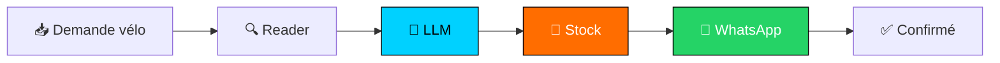

<p align="center">
  
  
  
</p>

<h1 align="center">🚀 Nouveau Projet — RepairFlow Vélo</h1>

<p align="center">
  <strong><em>« Client demande vélo → Mon site l'attribue → WhatsApp gère »</em></strong><br/>
  <strong>Lecture → Attribution → WhatsApp — 100% automatique, 0% oublié</strong>
</p>

---

## 📣 Annonce

> **RepairFlow est né !**
> Même méthode que **CyberAI UniversalAgent** (LLM propose → déterministe dispose), appliquée à ton terrain : **location vélo**.

**Slogan :**
> **« Ta flotte respire, tes clients sourient. »**
> **« Your fleet moves, your clients smile. »**

---

## 📸 En action

<p align="center">
  
</p>

| Client | → Stock | → WhatsApp |
|---|---|---|
| 🚲 2 électriques Alger | → `stock_ebike_1` | 💬 Staff + Client notifiés |
| 🚲 VTT Oran | → `stock_vtt_1` | 💬 Confirmé |
| 🚲 4 classiques Constantine | → `stock_velo_1` | 💬 Famille notifiée |

---

## 🗺️ Flux Fléché

```
📥 Demande site (LOC-xxx)
  → 🔍 TaskReader  ──→  API /rentals
  → 🧠 LLMAnalyzer ──→  velo_electrique / vtt / classique + urgence
  → 👤 Attributor ──→  POST /rentals/{id}/assign (stock)
  → 💬 WhatsApp    ──→  staff + client
  → 🔄 Tracker     ──→  site ↔ WhatsApp ↔ logs
```



---

## ⚡ Démo (dry_run vérifié)

```bash
PYTHONPATH=. python3 -m agent.orchestrator --once
# [+] 3 demandes → 3 DISPATCHED → WhatsApp dry_run
```

**Repo :** `repair-agent` — privé local, push GitHub dès création du dépôt.

---

<p align="center">
  <strong>Malek Boucetta</strong> — CyberAI → RepairFlow, même rigueur, nouveau terrain.<br/>
  <em>De l'hypothèse à la preuve. Du clic à la roue.</em>
</p>
