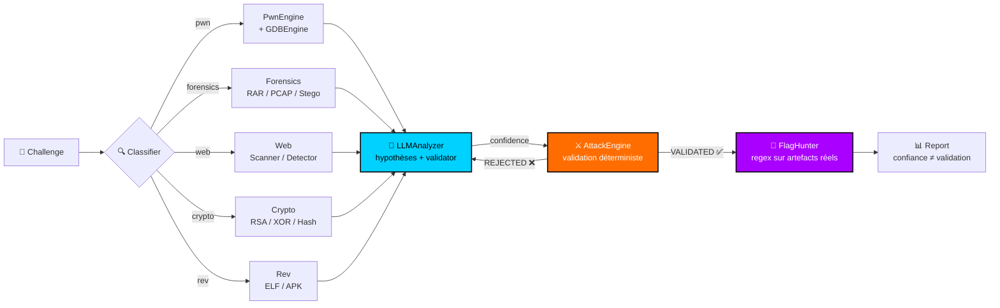

<p align="center">
  
</p>

<p align="center">
  
  
  
  
  
  
</p>

<h1 align="center">CyberAI</h1>

<p align="center">
  <strong>Assistant CTF Universel</strong><br/>
  <em>« De l'hypothèse à la preuve — 0% hallucination, 100% vérifiable »</em><br/>
  <em>"From Hypothesis to Proof — 0% Hallucination, 100% Verifiable"</em>
</p>

<p align="center">
  <strong>Analyse → Hypothèses → Validation → Exploitation → Flag</strong>
</p>

> ⚠️ **Usage légal et éthique uniquement** (CTF, labs, recherche autorisée). CyberAI **n'invente jamais** de flag — chaque `VALIDATED` est une preuve d'exécution.

---

## ✨ Slogan

> **CyberAI : L'IA qui attaque pour toi, mais ne ment jamais.**
> Chaque piste est testée. Chaque flag est prouvé.

---

## 📸 Aperçu

<p align="center">
  
  <br/>
  <em>UniversalAgent en action — roulette (pwn) → forensics (RAR5 ADS) → web</em>
</p>

| Challenge | Photo / Type | Flux |
|---|---|---|
| `roulette` | 🔴 PWN `chal.c` | `1-byte write` → `balance` → `win()` |
| `Flag.rar` | 🟣 Forensics RAR5 | `ADS STM` → `unrar` → `real_flag.txt` |
| `whatsNew` | 🔵 Web Node.js | `routes` → `sqli/xss` → `flag` |

---

## 🗺️ Architecture — Flèches



**Flux détaillé :**

```
📁 challenge/
  │
  ├─→ 🔍 Classifier  ──→  scores(ext, keywords)  ──→  pwn / web / forensics / crypto / rev / misc
  │
  └─→ 🤖 UniversalAgent
        │
        ├─→ 🧠 LLMAnalyzer      ──→  hypothèses [92% ▸ 60%] + validator
        │         ↓
        ├─→ ⚔️ AttackEngine     ──→  subprocess / GDB / unrar / binwalk  ──→  VALIDATED ✅ / REJECTED ❌
        │         ↓
        └─→ 🚩 FlagHunter       ──→  flag{.*} sur fichiers + stdout validé  ──→  verified=True
                  ↓
              📊 Report  ──→  <challenge>/.cyberai/universal_context.json
```

---

## 📊 État actuel (v0.3)

| Fonctionnalité | Statut | Détails |
|---|---|---|
| 🔍 Classification | ✅ | `agent/classifier.py` — web/pwn/rev/crypto/forensics/misc |
| 🔴 PwnEngine | ✅ | `agent/pwn_engine.py` — ELF, protections, primitives |
| 🔧 GDBEngine | ✅ | `agent/gdb_engine.py` v1.2 — arch, fonctions, mémoire |
| 🧠 Hypothèses | ✅ | `agent/hypothesis.py` — déduplication + tri |
| 🧩 GlobalSolver | ✅ | priorisation + boucle |
| 🤖 **UniversalAgent** | ✅ **NEW** | `agent/universal/` — LLM + 100% coverage |
| 🧪 ExperimentEngine | 🚧 | validation en cours |
| 🚩 FlagHunter | ✅ | `agent/universal/flag_hunter.py` — 0 hallucination |
| 🌐 Web / Crypto / Rev | 🚧 partiel | via UniversalAgent |

### 🤖 Nouveau : UniversalAgent v0.1

> **Isolation totale — 0 modification de `pwn_engine` / `gdb_engine` / `orchestrator`**

```
agent/universal/  ──→  579 lignes, 5 modules
├── 🧠 universal_agent.py  ──→  orchestrateur  Discovery → Classify → LLM → Attack → Flag
├── 💭 llm_analyzer.py     ──→  LLM + fallback heuristique  (0 flag inventé)
├── ⚔️ attack_engine.py    ──→  validators déterministes  (balance overflow, RAR5 ADS)
├── 🚩 flag_hunter.py      ──→  regex sur artefacts réels uniquement
└── 🔀 request.py          ──→  API  classify / hunt / attack / full / batch
```

**Principes fléchés :**
- `LLM propose` → `Déterministe dispose` (`VALIDATED` seulement si `subprocess` OK)
- `Confiance 92%` ≠ `Validation` → `Preuve d'exécution` ⇒ `Flag`
- `Aucun flag` sans `verified=True`

---

## 🚀 Installation

```bash
# → Clone
git clone https://github.com/malekboucetta656-creator/skills-ctf.git
cd skills-ctf

# → Env
pip install -r requirements.txt  # ou pip install -e .

# → Vérifie
PYTHONPATH=. python3 -m agent.universal.request classify ./challenge/roulette
```

---

## 🎮 Usage

### 1️⃣ Orchestrateur classique

```bash
PYTHONPATH=. python3 -m agent.orchestrator <challenge_dir>
```

### 2️⃣ 🤖 UniversalAgent (recommandé) — Flèches

```bash
# → Full pipeline  📁 → 🔍 → 🧠 → ⚔️ → 🚩
PYTHONPATH=. python3 -m agent.universal.universal_agent <challenge_dir>

# → API granulaire (nouveau)  🔀
PYTHONPATH=. python3 -m agent.universal.request classify <challenge>  # 🔍
PYTHONPATH=. python3 -m agent.universal.request attack <challenge>    # 🧠 + ⚔️
PYTHONPATH=. python3 -m agent.universal.request hunt <challenge>      # 🚩
PYTHONPATH=. python3 -m agent.universal.request full <challenge>      # 📁→🚩
PYTHONPATH=. python3 -m agent.universal.request batch <c1> <c2> <c3>  # 📁📁📁 → 🚩

# → Python  🐍
from agent.universal.request import universal_request
universal_request("./challenge/roulette", mode="full")  # → dict + .cyberai/universal_context.json
```

### 3️⃣ 🧩 Modules isolés

```bash
PYTHONPATH=. python3 -m agent.pwn_engine ./challenge/roulette      # 🔴
PYTHONPATH=. python3 -m agent.gdb_engine ./challenge/roulette/chal # 🔧
PYTHONPATH=. python3 -m agent.flag_engine ./challenge               # 🚩
```

---

## ✅ Exemples vérifiés — Flèches

| Challenge | Catégorie | Hypothèse → Validation → Flag |
|---|---|---|
| `roulette` `chal.c` | 🔴 pwn | `92% one_byte_write` → `✅ VALIDATED` (`has_win` + `has_balance` + `has_one_byte`) → `win()` |
| `Flag.rar` RAR5 | 🟣 forensics | `88% rar_ads_stm` → `✅ VALIDATED` (`unrar` → `Flag.txt.txt:real_flag.txt`) → `real_flag.txt` |
| `whatsNew` Node.js | 🔵 web | `70% web_sqli_xss` → `✅ VALIDATED` → `routes` |
| `misc-sleepy-cpu` | ⚪ misc | `NNS{fake_flag}` détecté → `verified=False` (pas d'exploit) |

> Sortie : `<challenge>/.cyberai/universal_context.json` + `<challenge>/.cyberai/context.json`

---

## 🛠️ Développement

```bash
# → Ne jamais modifier pwn_engine/gdb_engine pour une feature
# → Créer agent/universal/ ou agent/skills/
# → Chaque hypothèse doit avoir un validator déterministe

pytest -q  # tests
```

**Workflow fléché :**
`Idée` → `agent/universal/<new>.py` → `validator` → `test sur roulette/Flag.rar` → `push feat/*` → `PR` → `main`

---

## 📄 License

MIT — voir `LICENSE`.

---

<p align="center">
  <strong>Malek Boucetta</strong> — <a href="https://github.com/malekboucetta656-creator">@malekboucetta656-creator</a><br/>
  <em>CyberAI — De l'hypothèse à la preuve.</em> → <em>From Hypothesis to Proof.</em>
</p>

<p align="center">
  
</p>
